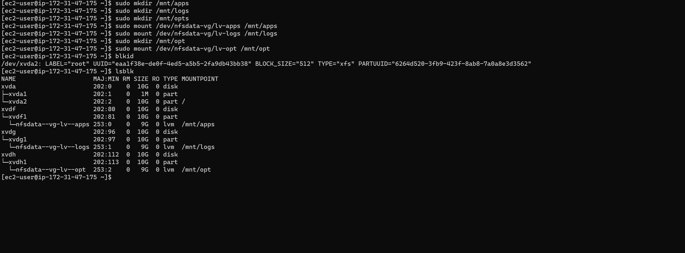

# Project-7

# DEVOPS TOOLING WEBSITE SOLUTION

For this Project, 5 instances will be created on the AWS EC2. 4 instances of Red Hat Server (One for the NFS server and the other three for Webserver) and 1 instance of Ubuntu server for the Database Server.

Three EBS Volumes also be created in the same availability zone with the NFS Server and named NFS1, NFS2 and NFS3. The three EBS volumes will be attached to the NFS Server 


## Prepare NFS Server

Launch the NFS Server Instance and connect to it via the terminal

Check if the volume attached are connected

`lsblk`

`df -h`

Then Create partition on the three Volumes that are named xvdf, xvdg, xvdh

`sudo gdisk xvdf`


Do same for xvdg and xvdh

Then Install LVM

`sudo yum update -y`

`sudo yum install lvm2 -y`

Use pvcreate utility to mark each of 3 disks as physical volumes (PVs) to be used by LVM

`sudo pvcreate /dev/xvdf1 /dev/xvdg1 /dev/xvdh1`

`sudo pvs`

Use vgcreate utility to add all 3 PVs to a volume group (VG). Name the VG nfsdata-vg

`sudo vgcreate nfsdata-vg /dev/xvdf1 /dev/xvdg1 /dev/xvdh1`

`sudo vgs`

Use lvcreate utility to create 3 logical volumes. apps-lv, logs-lv and opt-lv


`sudo lvcreate -n apps-lv -L 9G nfsdata-vg`

`sudo lvcreate -n logs-lv -L 9G nfsdata-vg`

`sudo lvcreate -n opt-lv -L 9G nfsdata-vg`

`sudo lvs`

Use mkfs.xfs to format the logical volumes with xfs filesystem

`sudo mkfs.xfs /dev/nfsdata-vg/apps-lv`

`sudo mkfs.xfs /dev/nfsdata-vg/logs-lv`

`sudo mkfs.xfs /dev/nfsdata-vg/opt-lv`


Create the following directory /mnt/apps, /mnt/logs, /mnt/opt and mount the filesystem

`sudo mkdir /mnt/apps`

`sudo mkdir /mnt/logs`

`sudo mkdir /mnt/opt`

Then mount the file system

`sudo mount /dev/nfsdata-vg/apps-lv /mnt/apps`

`sudo mount /dev/nfsdata-vg/logs-lv /mnt/logs`

`sudo mount /dev/nfsdata-vg/opt-lv /mnt/opt`

check if the mounting was successful 

`df -h`



Then update the /etc/fstab with the volumes

`sudo vi /etc/fstab`


`sudo mount -a`

`sudo systemctl daemon-reload`

### Install the NFS Server

Copy the code line by line and run it to make nfs server installed and start automatically in case of any reboot

```
sudo yum -y update
sudo yum install nfs-utils -y
sudo systemctl start nfs-server.service
sudo systemctl enable nfs-server.service
sudo systemctl status nfs-server.service
```
### Then we set up permission that will allow our Web servers to read, write and execute files on NFS.

Copy the line after each other and run it 

```
sudo chown -R nobody: /mnt/apps
sudo chown -R nobody: /mnt/logs
sudo chown -R nobody: /mnt/opt

sudo chmod -R 777 /mnt/apps
sudo chmod -R 777 /mnt/logs
sudo chmod -R 777 /mnt/opt

sudo systemctl restart nfs-server.service
```

Configure access to NFS for clients within the same subnet

`sudo vi /etc/exports`

Then insert the codes below inside the file

```
/mnt/apps 172.31.32.0/20(rw,sync,no_all_squash,no_root_squash)
/mnt/logs 172.31.32.0/20(rw,sync,no_all_squash,no_root_squash)
/mnt/opt 172.31.32.0/20(rw,sync,no_all_squash,no_root_squash)
```
`sudo exportfs -arv`

### Check which port is used by NFS and open it using Security Groups (add new Inbound Rule)

`rpcinfo -p | grep nfs `

Then on the AWS security group, make the necessary rule for the connection


## Configure the Database Server

Connect to the Ubuntu Instance already tagged as the Database server

`sudo apt update`

`sudo apt install mysql-server`

`sudo mysql`

Then copy the code line by line and run it

```
create database tooling;

create user 'webaccess'@'172.31.32.0/20` identified by 'password'

grant all privileges on tooling.* to 'webaccess'@'172.31.32.0/20`;

flush privileges;

show databases;

exit
```

## Prepare the Web Servers